## Introduction
This Vignette gives a quick demo of the "Water" package developed to conduct water consumption analysis on the  YVW dataset.
To reproduce the work and analysis conducted throughout this project, we packaged the code base into an R-package encapsulating all the functionalities needed for future consumption analysis. We designed this package into a modular architecture to allow future reuse and incoporation in any internal YVW project. Overall the package comprises 5 submodules:

- Data Utilities Modules: Handles all data loading, preparation and time series standardization.
- Visualisation Module: Generates diagnostic plots and visualisation for further analysis.
- Leak Analysis Module: Conducts leak detection based on the MIN and MEU methods discussed earlier.
- Forecast Module: Implements two forecasting methods discussed earlier at customer level and total demand level.
- Clustering Module: Handles all customer clustering process based on consumption and other time series features.
With these modules we will illustrate some of the potential uses to draw insights from water consumption data.

## Data Loading
To ingest data into the package the data source has to be a csv file in the following format. Such file can be easily obtained by outputing databse view into csv.

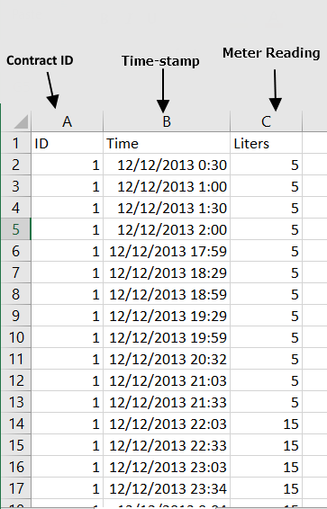

To read the file invoke the following command:
```
library(water)
#Read toy dataset for demonstration
meter_sample <-read_from_csv('../data/sample_meter.csv',align_and_pad = TRUE)
```
 To investigate the options associated with `read_from_csv` function check the help document via `help(read_from_csv)`

## Consumption Visualisation
This submodule visualises the consumption data into series of diagnostic plots, including:
- Raw consumption series: the original series for quality check.
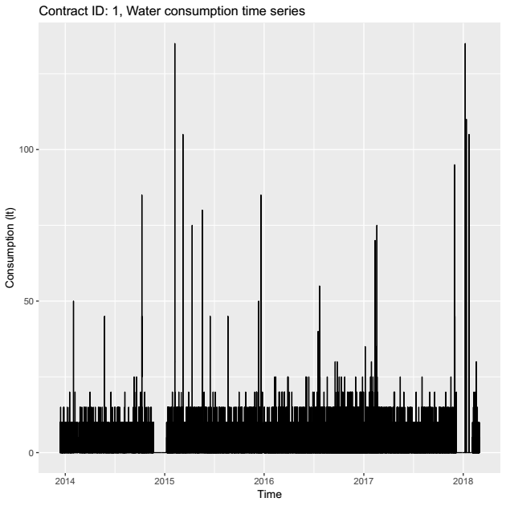

- Calendar Plot: A line chart plot of consumption overlied on a calendar layout. This helps to investigate the consumption variation on a dayily, monthly and annual scale.
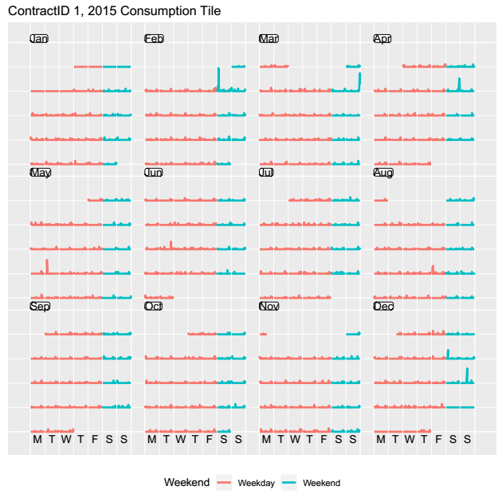

- Calendar Tile: Simillar to the previous one but plots the aggregate daily consumptin on calendar layout.

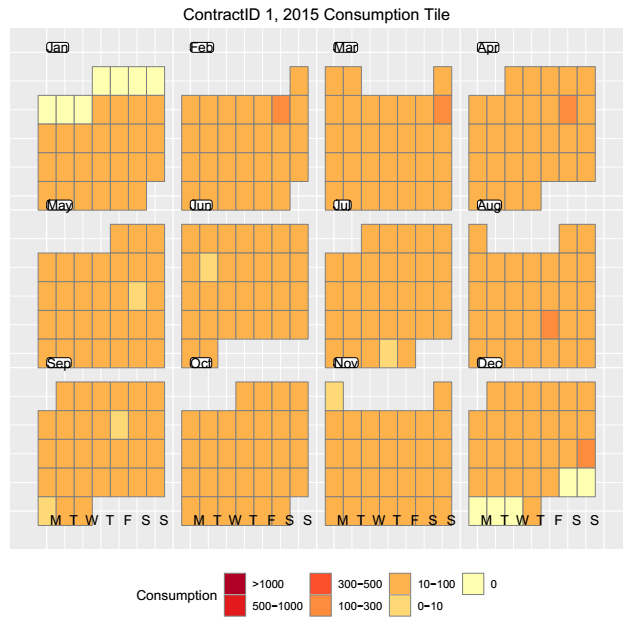

- Daily Plot: this displays the avearage daily consumption per day of the week for Winter and Summer.

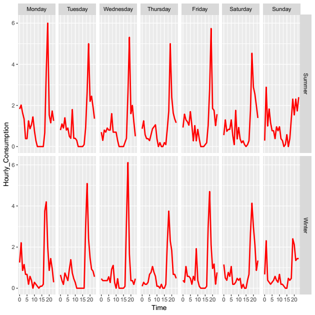

- Heat Plot: Displays consumption as  heatmap with X axis as the date, y-axis as the hour of the day and colour depicting the consumption.

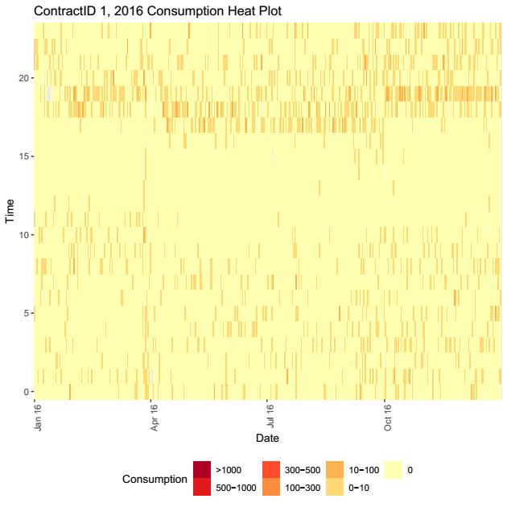

These visualisation could be ouptuted as individual `png` files or a single `pdf` including all the plots for the contract from `meter_sample` file. To customize the visualisation further look up the the associate help doc.
```
help(consumption_vis)
consumption_vis(meter_sample, output_format = 'pdf')
```
## Leak Detection
As highlighted in the report, the package makes use of two leakage detection methods: (1) Min Method and (2) MEU Method. This method can be accessed using the follwoing code. The result can be outputed as `pdf` or `csv` formats.
```
help(leak_detection)
leak_detection(meter_sample,method = 'min',pdf_file = 'test')
leak_detection(meter_sample,method = 'meu',pdf_file = 'test')
```

Sample pdf output from leak detection function


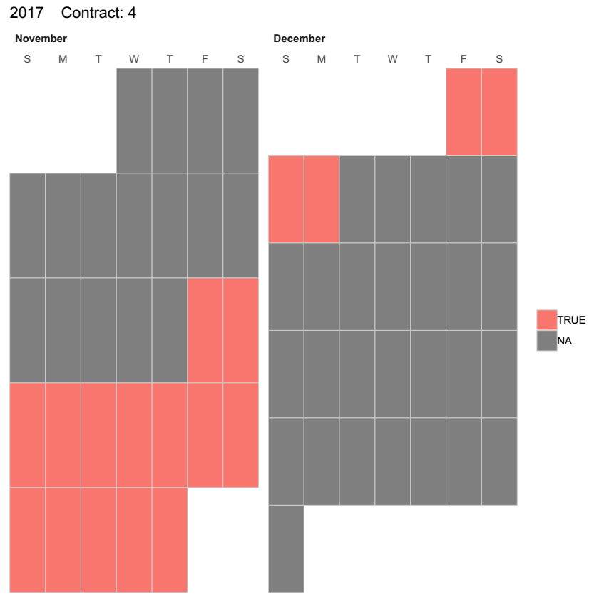

## Forecast:
Demand Forecasting
As discussed with YVW, we consider two different application cases in the forecasting.
### Use case 1: Predict monthly series for individual customer benchmarking
Forecast cutomers monthly consumption for the next 6 months. This function uses ETS model and require at least 2 years of consumption histor to generate forecast. The function outputs the result into `pdf` file.
```
customer_forecast_ets(meter_sample,plot_type = 'line',pdf_file = 'fcast')
```
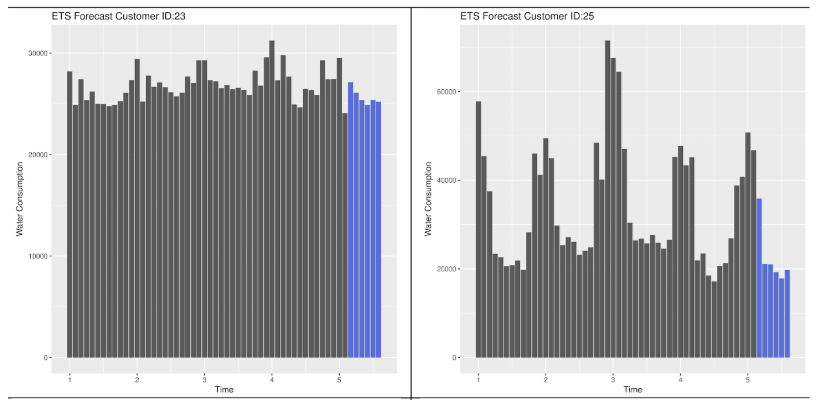

### Use case 2: Hourly prediction for overall consumption aggregate
Conduct 24 hour consumption forecast for aggregatre consumption from the list of contracts passed to the function
NOTE: This forecast could take few minutes to finish
```
hourly_forecasst(meter_sample,plot_type = 'line',pdf_file = 'fcast')
```
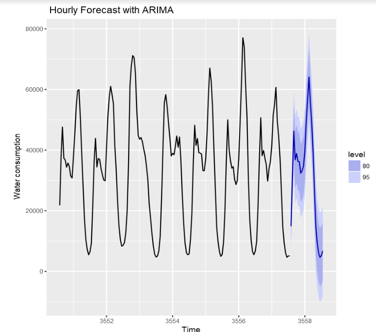


## Clustering and Benchmarking
This section demonstrates how to use the Clustering module in the R-Package to perform four distinct but related tasks:

1. Use the `extract_features` function to perform feature extraction on a set of customers timeseries data to summarize each series with a set of features rather than using each series as a whole (which is sometimes several years worth of data)

2. Use the extracted features as an input for the `calculate_clusters` function to cluster (i.e. group) customers into groups which share similar consumption behaviour.

3. Use the `calculate_consumption_aggregates` function to calculate the usage consumption averages for a set of contracts for three different modalities (daily, weekly, and seasonally). These averages are to be used later in the benchmarking function to compare and contrast cutomers/clusters.

4. Use the cluster output together with aggregated consumption data as an input to `benchmark_customer` function which provides radar charts to compare each customer with his/her cluster. 

### extract_features
```
features <- extract_features(meter_sample)
head(features)
# optionally write the results to a csv file to use it later
write.csv(features, "my_features.csv", row.names = FALSE)
```


### calculate_clusters
Since the meter_sample contains only a sample of five service contracts, it will not be enough to demonstrate the clustering function. `calculate_cluster` requires at least 20 service contracts to be able to conduct a clustering analysis. Therefore, we will use a features file that was pre-extracted using all the potable_water contracts in the YVW dataset. 

```
features <- read.csv("../data/clean_features_potable_water.csv")
clusters <- calculate_clusters(features, k_max = 8)
```
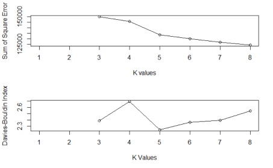

To obtain the final cluster assignment and pick the best number of clusters, `calculate_clusters` function works iteratively and calculate clusterness metric for different number of clusters (2 < k < k_max). Accordingly, the best k (having the best clusterness metric) is selected. Subsequently, the number of members of each cluster is then calculated, if any of the clusters is found to have very few members, those members are considered outliers and are removed from the clustering analysis. Then the whole process is repeated again. These iterations continue until the algorithm finds an assignment that provides a reasonable number of cluster members in each cluster. Alternatively, the user can predefine the number of desired clusters (if prior knowledge exists as to how many distinct group of people there is) by specifying the k_override function parameter.

The cluster object returned from the function is a list of items as follows:

1. centers_scaled: The final cluster centers (standardised to mean = 0 and sd = 1)
2. centers_unscaled: The final unscaled clusters centers
3. k: The final number of clusters selected by the algorithm.
4. cluster_assignment: a dataframe depicting each service contract id and the cluster number it belongs to
5. plot_object: a plot object for the final cluster centroids in a barchart representation
6. PCA.plot: a scatter plot of all the service contracts color coded by their cluster assignment (due to the large number of features, PCA is used to reduce the dimensionality to 2 to enable plotting it, be aware of possible distortion)
```
print(paste("Final number of Clusters:", clusters$k))
head(clusters$cluster_assignment, 10)
clusters$PCA.plot
```
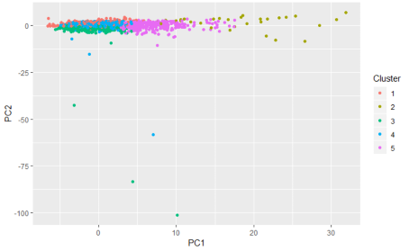

### calculate_consumption_aggregates
This function is an enabler for the `benchmark` function. The reason this function is exposed to the users is that it is time consuming in nature and hence it is better to run it once for all the customer data (or for those customers who are of interest) and save its results to disk. This way, it can be used several times later in the benchmarking function (illustrated later)
```
consumption_averages <- calculate_consumption_aggregates(timeseries_list = meter_sample, filename = "cons_avgs.rds")  # note that if a filename is not given, the results won't be saved to disk
```


### benchmark
The benchmark function plots a group of radar charts to benchmark a customer against his/her cluster or to compare the different clusters. The comparison/benchmarking is done in terms of consumption averages for three different modalities (daily, weekly, seasonlly)
For this function to work, the two above steps must be completed first: 
1. a cluster object to be calculated using calculate_clusters function 
2. consumption aggregates to be calculated using calculate_consumption_aggregates
```
# to compare all clusters together
benchmark(clust_obj = clusters, aggregates_list = consumption_averages, plot_title = "All clusters")

# to benchmark customer (with service_id 20) with his/her cluster
benchmark(clust_obj = clusters, aggregates_list = consumption_averages, service_id = 20, plot_title = "All clusters")
```
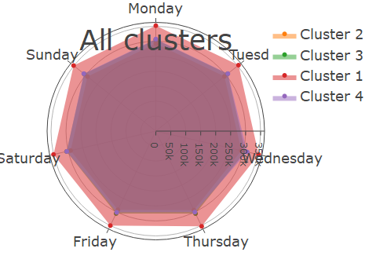
